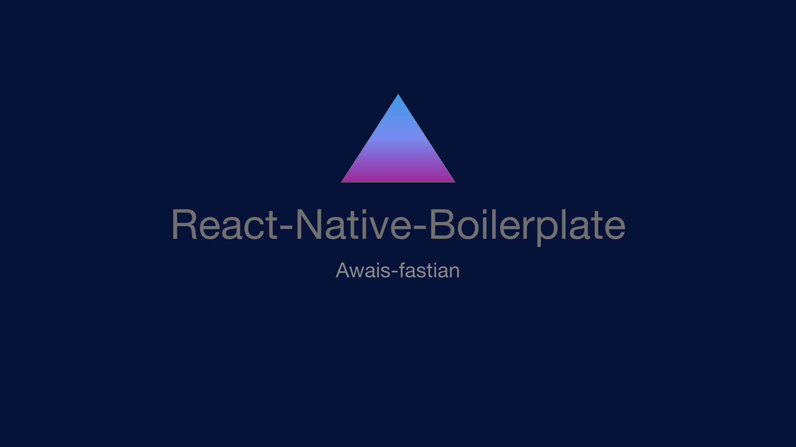

<div align="center">
    
</div>

[](https://shields.io/)
[](https://shields.io/)
[](https://shields.io/)
[](https://shields.io/)
[](https://shields.io/)
[](https://shields.io/)
[](https://shields.io/)
[](https://shields.io/)
[](https://shields.io/)
[](https://shields.io/)
[](https://shields.io/)
[](https://shields.io/)

# React-Native-Boilerplate

This project is a [React Native](https://facebook.github.io/react-native/) boilerplate that can be used to kickstart a mobile application.

The boilerplate provides **a architecture optimized for developing reliable cross-platform mobile applications** through the separation of concerns between the UI and business logic. It is remarkably documented so that each section of code that lands in your application can be understood and used.

```
If you find this boilerplate useful then please give the repository a star
```

## Architecture

The main purpose of the Architecture of the boilerplate is the separation of concerns

- Presentational **components** are separated from **screens**.

- **State** is managed using global [Redux](https://redux.js.org/) stores.

- Application side-effects (API calls, etc.) are separated from **UI** and **state** manipulation using [Redux Saga](https://redux-saga.js.org/).

## Content

The boilerplate contains:

- [React Native](https://facebook.github.io/react-native/) (v**0.63.2**)
- [Clear directory layout](#directory-layout) to provide a base architecture for your application
- [Redux](https://redux.js.org/) (v4.0.5) to help manage state
- [Redux Persist](https://github.com/rt2zz/redux-persist) (v6.0.0) to persist the Redux state
- [Redux Sagas](https://redux-saga.js.org) (v1.1.3) to separate side-effects and logic from state and UI logic
- [React Navigation 5](https://reactnavigation.org/) with a [`NavigationService`](App/Navigation/NavigationService.js) to handle routing and navigation in the boilerplate
- [i18Next](https://www.i18next.com/) (v11.3.5) to facilitate the more than one language in the App
- [Firebase](https://rnfirebase.io/) (v5.6.0)
- [Push Notifications](https://rnfirebase.io/messaging/usage) integrated in the boilerplate
- [Code-Push](https://github.com/Microsoft/react-native-code-push) (v6.2.0) This plugin provides client-side integration for the CodePush service, allowing you to easily add a dynamic update experience to your React Native app(s).
- [react-native-fbsdk](https://github.com/facebook/react-native-fbsdk) (v2.0.0) to facilitate the facebook login
- [google-signin](https://github.com/react-native-community/google-signin) (v4.0.0) to facilitate the google signin
- [Theme Support](https://callstack.github.io/react-native-paper/theming.html) with a [`DarkTheme`](App/Utils/DarkTheme.js) and [`LightTheme`](App/Utils/LightTheme.js)
- [react-native-splash-screen](https://github.com/crazycodeboy/react-native-splash-screen) (v3.2.0) setup by default
- [axios](https://github.com/axios/axios) to make API calls (v0.19.2)
- [TypeScript](https://www.typescriptlang.org/) configured for React Native
- [prettier](https://prettier.io/) and [eslint](https://eslint.org/) pre configured for React Native

**Note:** Custom Drawer and Custom Bottom Tabs are also part of the boilerplate.

## Directory layout

- [`app/components`](app/components): Presentational components
- [`app/screens`](app/screens): The application's screens
- [`app/assets`](app/assets): Assets (image, audio files) used by the application
- [`app/i18next`](app/i18next): Language setup and localize used by the application
- [`app/navigation`](app/navigation): React-Navigation setting
- [`app/redux/store`](app/redux/store): Redux store
- [`app/redux/sagas`](app/redux/saga): Redux sagas
- [`app/redux/actions`](app/redux/action): Redux actions
- [`app/redux/reducers`](app/redux/reducers): Redux reducers
- [`app/redux/connects`](app/redux/connects): Redux data connectors
- [`app/redux/types`](app/redux/types): Redux action types
- [`app/redux/api`](app/redux/api): application services, e.g. API clients
- [`app/Utils`](app/Utils): Styles helpers for the application
- [`app/config`](app/config): Routes and Screen configurations
- [`app/constants`](app/constants): Colors, images and common styles
- [`app/helpers`](app/helpers): Colors, images and common styles

## Requirements

Node 8 or greater is required. Development for iOS requires a Mac and Xcode 9 or up and will target iOS 9 and up.

You also need to install the dependencies required by React Native:

- For [Android development](https://facebook.github.io/react-native/docs/getting-started.html#installing-dependencies-3)
- For [iOS development](https://facebook.github.io/react-native/docs/getting-started.html#installing-dependencies)

## Using the boilerplate

To create a new project using the boilerplate:

- Clone this repository
- Remove the previous git history: `rm -rf .git/`
- Install the npm dependencies by running `yarn` or `npm install`
- ##### Rename the React Native project (Without custom Bundle Identifier)
  `yarn run rename -- <YourProjectName>` or `npm run rename -- <YourProjectName>` (the default name is `boilerplate`)
- ##### Rename the React Native project (With custom Bundle Identifier, Android only. For iOS, please use Xcode)
  `yarn run rename -- <YourProjectName> -b <bundleIdentifier>` or `npm run rename -- <YourProjectName> -b <bundleIdentifier>` (the default name is `boilerplate`)
- ##### [Facebook SDK Android/iOS Setup](https://github.com/facebook/react-native-fbsdk)
  For facebook login to work in the android app please replace `FacebookAppID` and `FacebookLoginProtocolScheme` value in the .env.staging and .env.production files present in the root directory
- ##### [Google Sign-In SDK Android Setup](https://github.com/react-native-community/google-signin/blob/master/docs/android-guide.md)
  For push notifications and google signin to work in the android app place your `google-services.json` into `Android/app` folder
- ##### [Google Sign-In SDK iOS Setup](https://github.com/react-native-community/google-signin/blob/master/docs/ios-guide.md)
  For push notifications and google signin to work in the iOS app drag your `GoogleService-Info.plist` to project folder in the xcode and replace `REVERSED_CLIENT_ID` value present in the `.env.staging` and `.env.production` with `REVERSED_CLIENT_ID` present in the GoogleService-info.plist
- ##### [Optional][codepush android setup](https://github.com/microsoft/react-native-code-push/blob/master/docs/setup-android.md)
  For code-push to work in the android app please first [create app on app center for os="Android" and platform="React Native" ](https://appcenter.ms/) . After creating the app you will get app secret key, insert your app_secret into `android/app/src/main/assets/appcenter-config.json`. Go to the `Distribute` side menu on the app center, click code push, and generate production and staging deployment keys. Place production deployment key into file `.env.production` present in the root directory against key `CodePushDeploymentKey_Android` and place staging deployment key into file `.env.staging` present in the root directory against key `CodePushDeploymentKey_Android` 
- ##### [Optional][codepush ios setup](https://github.com/microsoft/react-native-code-push/blob/master/docs/setup-ios.md)

  For CodePush to work in the iOS app please first [create app on app center for os="iOS" and platform="React Native" ](https://appcenter.ms/) . After creating the app you will get the app secret key, insert your app_secret into `AppCenter-Config.plist`. Go to the `Distribute` side menu on the app center, click code push, and generate production and staging deployment keys. Place production deployment key into file `.env.production` present in the root directory against key `CodePushDeploymentKey_iOS` and place staging deployment key into file `.env.staging` present in the root directory against key `CodePushDeploymentKey_iOS`

You can now create a new git repository for your project (using `git init`) and create the first commit.

## Running the project

Assuming you have all the requirements installed, you can setup and run the project by running:

- `yarn` or `npm install` to install the dependencies
- Run the following steps for your platform

### Android

- Only the first time you run the project, you need to generate a debug key with:
  - `cd android/app`
  - `keytool -genkey -v -keystore debug.keystore -storepass android -alias androiddebugkey -keypass android -keyalg RSA -keysize 2048 -validity 10000`
  - `cd ../..` to come back to the root folder
- `yarn start` or `npm install` to start the metro bundler, in a dedicated terminal
- `yarn run android:debug-release` or `npm run android:debug-release` to run the Android application (remember to start a simulator or connect an Android phone)

### iOS

- `cd ios`
- `pod install` to install pod dependencies
- `cd ..` to come back to the root folder
- `react-native run-ios` to run the iOS application (remember to start a simulator or connect an iPhone phone)

## Useful documentation

### [CodePush](https://microsoft.github.io/code-push/)

CodePush is an App Center cloud service that enables Apache Cordova and React Native developers to deploy mobile app updates directly to their users’ devices.

### [Google Sign-In SDK](https://github.com/react-native-community/google-signin)

Google Sign-In is a secure authentication system that reduces the burden of login for your users, by enabling them to sign in with their Google Account—the same account they already use with Gmail, Play, and other Google services.

### [Facebook SDK](https://github.com/facebook/react-native-fbsdk)

The Facebook SDK for is the easiest way to integrate your app with Facebook. It enables:

- `Facebook Analytics` - Understand how people are using your product.
- `Facebook Login` - Authenticate people with their Facebook credentials.
- `Share and Send dialogs` - Enable sharing content from your app to Facebook.
- `App Events` - Log events in your application.
- `Graph API` - Read and write to Graph API.

### [I18next](https://www.i18next.com/)

I18next is an internationalization-framework written in and for JavaScript. But it's much more than that.

i18next goes beyond just providing the standard i18n features such as (plurals, context, interpolation, format). It provides you with a complete solution to localize your product from web to mobile and desktop.

## License

This project is released under the [MIT License](LICENSE).

## Why this boilerplate?

I looked into existing boilerplates before starting this project, and while many of them are awesome, But every boilerplate was lacking something, so I come up with a boilerplate that has all the features that modern app needed. For example

- `React Native Latest Stable Version (v0.63.2)`
- `Great Architecture`
- `React Navigation 5 Integrated`
- `Redux Integrated`
- `Redux Saga Integrated`
- `Redux Persist Integrated`
- `Firebase SDK Integrated`
- `Facebook SDK Integrated`
- `Google Sign-in SDK Integrated`
- `Code-Push SDK Integrated`
- `Push Notifications Integratd`
- `Theme Integrated`
- `Multilingual Integrated`
- `Splash Screen Integrated`
- `Vector Icons Integrated`
- `TypeScript Support`
